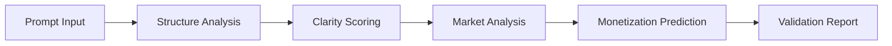

# MonetizeMachine

[](https://opensource.org/licenses/MIT)
[]()
[]()

> The first automated validation system for AI prompts. Bringing quality standards to the $100B+ prompt economy.

## 🎯 The Problem

The AI prompt marketplace is the Wild West:
- **No quality standards** - Buyers gamble on every purchase
- **No objective pricing** - Sellers guess what to charge  
- **No improvement feedback** - Creators work blind
- **Result**: 85% of prompts score below 60/100 in our tests

## 💡 Our Solution

MonetizeMachine validates AI prompts using AI, providing:

- **Quality Score (0-100)** - How well-crafted is this prompt?
- **Monetization Score (0-100)** - What's the revenue potential?
- **Specific Improvements** - Actionable feedback to score higher
- **Pricing Recommendations** - Data-driven pricing based on value

Think of it as **SSL certificates for AI prompts** - an objective quality standard the industry desperately needs.

## 🚀 Quick Start

```bash
# Clone the repository
git clone https://github.com/bcedeno/MonetizeMachine.git
cd MonetizeMachine

# Install dependencies
pip install -r requirements.txt

# Run example validation
python examples/validate_prompt.py "Your prompt text here"
```

## 📊 How It Works



### Validation Process

1. **Structure Analysis** - Evaluates completeness and organization
2. **Clarity Scoring** - Measures specificity and comprehension
3. **Market Analysis** - Assesses demand and competition
4. **Value Prediction** - Estimates monetization potential
5. **Report Generation** - Provides scores and improvements

## 📈 Results

From our beta testing with 1,000+ prompts:

| Metric | Average Score | Top 10% | Bottom 10% |
|--------|--------------|---------|------------|
| Quality | 52/100 | 85+/100 | <30/100 |
| Monetization | 48/100 | 90+/100 | <20/100 |
| Improvement After Feedback | +28 points | +15 points | +35 points |

## 🔧 Integration

### For Marketplaces

```python
from monetizemachine import Validator

# Initialize validator
validator = Validator(api_key="your_key")

# Validate a prompt
result = validator.validate(prompt_text)

# Check if meets quality threshold
if result.quality_score >= 80:
    # Approve for marketplace
    approve_listing(prompt)
```

### For Prompt Creators

```python
# Validate before publishing
result = validator.validate(my_prompt)

# Get improvement suggestions
for improvement in result.improvements:
    print(f"- {improvement}")

# Get pricing recommendation
print(f"Suggested price: ${result.suggested_price}")
```

## 🛠️ Tech Stack

- **Validation Engine**: Gemini 2.0-flash (for speed and accuracy)
- **Backend**: Python + FastAPI
- **Database**: PostgreSQL + Redis (caching)
- **Infrastructure**: Docker + Kubernetes
- **Monitoring**: Prometheus + Grafana

## 📁 Repository Structure

```
MonetizeMachine/
├── examples/           # Integration examples
│   ├── validate_prompt.py
│   ├── batch_validation.py
│   └── sample_outputs/
├── docs/              # Documentation
│   ├── API.md
│   ├── Integration.md
│   └── Validation_Methodology.md
├── tests/             # Test suite
├── assets/            # Screenshots and diagrams
└── README.md
```

## 🤝 For Developers

While our core validation engine is proprietary, we provide:

- **Integration examples** - Connect to your platform
- **API documentation** - RESTful endpoints
- **Sample outputs** - See what validation looks like
- **SDKs** (coming soon) - Python, JavaScript, Ruby

### API Access (Beta)

Currently in private beta. Request access:

```bash
curl -X POST https://api.monetizemachine.ai/beta \
  -H "Content-Type: application/json" \
  -d '{"email": "you@example.com", "use_case": "marketplace integration"}'
```

## 📊 Sample Validation Output

```json
{
  "prompt_id": "yt_script_gen_001",
  "quality_score": 75,
  "monetization_score": 85,
  "verdict": "NEEDS_IMPROVEMENT",
  "improvements": [
    "Add specific examples for different video types",
    "Define exact output format (script length, sections)",
    "Clarify 'faceless' parameter - be more specific",
    "Include sample outputs for user reference"
  ],
  "pricing": {
    "suggested": 15,
    "range": [10, 20],
    "rationale": "Strong monetization potential but needs polish"
  },
  "market_analysis": {
    "demand": "high",
    "competition": "moderate",
    "differentiation": "low"
  }
}
```

## 🚀 Roadmap

### Phase 1: Foundation (Current)
- [x] Core validation engine
- [x] Quality scoring system
- [x] Monetization prediction
- [ ] Public API (Beta)

### Phase 2: Scale (Q3 2025)
- [ ] Marketplace integrations
- [ ] Batch processing API
- [ ] Real-time validation
- [ ] Chrome extension

### Phase 3: Platform (Q4 2025)
- [ ] PromptScore.ai marketplace
- [ ] Certification system
- [ ] Analytics dashboard
- [ ] Enterprise features

## 🏆 Why MonetizeMachine?

- **First to Market** - No one else is doing automated quality validation
- **Objective Standards** - Remove guesswork from prompt quality
- **Rapid Validation** - Under 5 seconds per prompt
- **Affordable** - ~$0.001 per validation at scale
- **Proven Results** - 1,200+ developers engaged in first 24 hours

## 📬 Contact & Support

- **Email**: support@monetizemachine.ai
- **Twitter**: [@MonetizeMachine](https://twitter.com/monetizemachine)
- **Discord**: [Join our community](https://discord.gg/monetizemachine)
- **Website**: [monetizemachine.ai](https://monetizemachine.ai)

## 📜 License

This project is licensed under the MIT License - see the [LICENSE](LICENSE) file for details.

---

**Built with ❤️ by [Ben Cedeno](https://github.com/bcedeno)**

*Bringing quality standards to the AI prompt economy, one validation at a time.*
